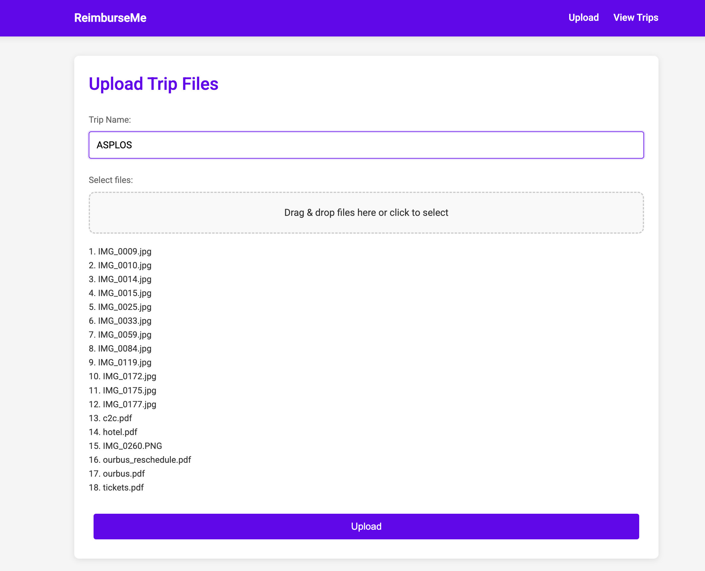
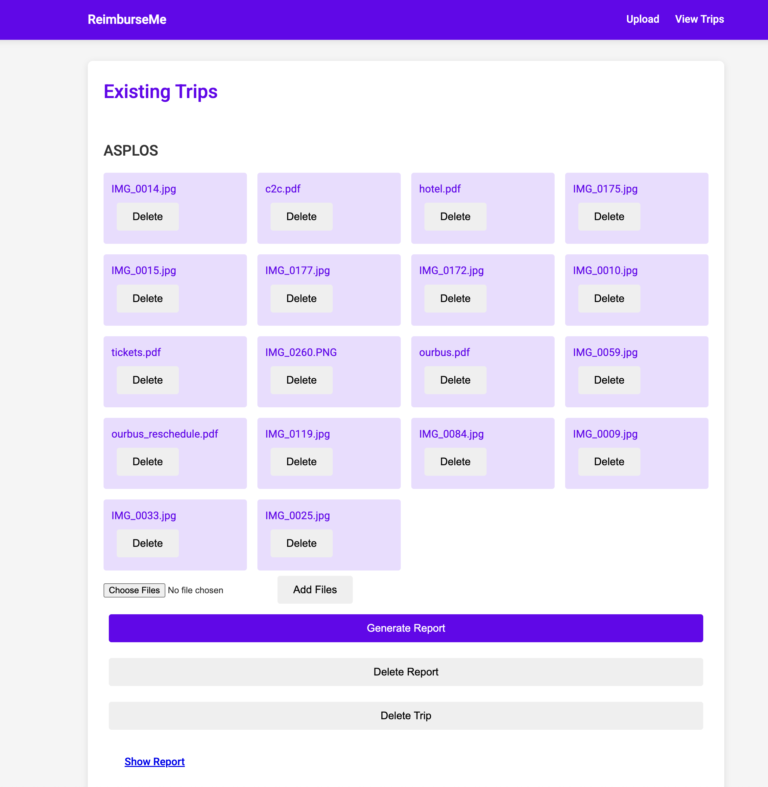
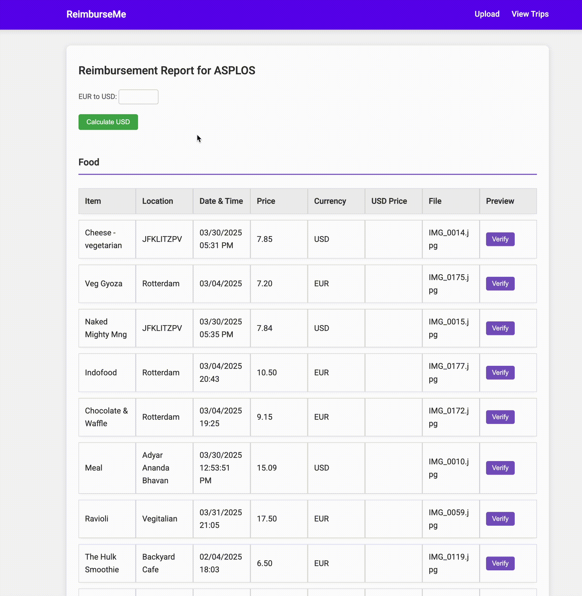

## What is ReimburseMe

ReimburseMe is an LLM based tool to streamline the reimbursement process for work-related expenses.
It allows users to upload receipts in multiple formats (PDF, PNG, JPEG) and view them in a structured report.

### Demo Overview

- **Uploading Receipts**  
  

- **Click on generate report and wait for a few seconds (takes 10s of seconds)**  
  

- **Explore the generated report**  
  

## Setup Instructions

1. **Create and activate a conda environment**:
```bash
conda create -n tripenv python=3.10 -y
conda activate tripenv
```

2. **Install dependencies**:
```bash
pip install flask
export OPENAI_API_KEY="your key"
```

3. **Run the application**:
```bash
python app.py
```

4. **Visit in browser**:
```
http://127.0.0.1:5000/
```